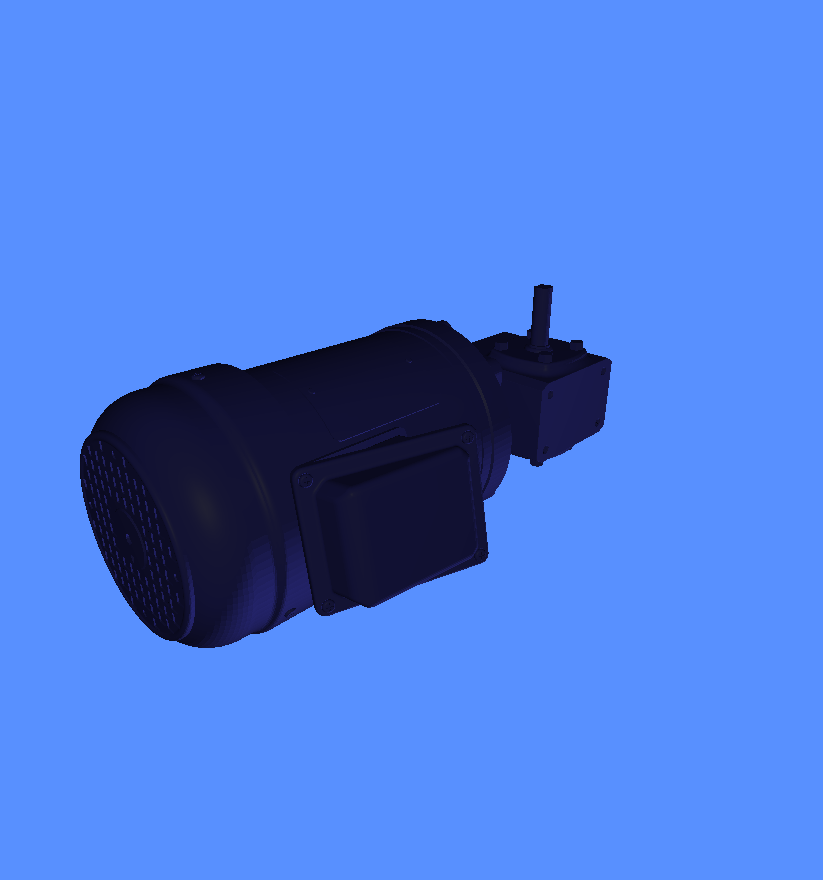

# Ash’s OBJ Viewer

Because sometimes you just want a rotating product shot from an `.obj` without starting a Blender pilgrimage, learning seven hotkeys for “orbit”, and accidentally becoming a 3D monk.

This is a **local-only** OBJ viewer + **turntable renderer** built with PyQt5 + pyqtgraph.opengl.  
Dark navy + orange theme included, because grey UI is how joy dies.

There is also a **Windows EXE release** for people who would rather double-click than negotiate with Python.

---

## What This Thing Does

### View OBJs
- Load an `.obj` and preview it in a real-time OpenGL viewport
- Smooth or Flat shading
- Faces / Edges / Wireframe-only
- Edge alpha slider so your wireframe isn’t screaming at you

### Baked Lighting (Without Shader Drama)
This app “bakes” lighting into vertex colours (diffuse + specular-ish) so it looks decent even if your pyqtgraph shader options are… temperamental.

- Lighting modes:
  - Headlight (camera): light follows the camera
  - Fixed (world): light stays in world space like a stage lamp
- Light brightness slider (scales diffuse + spec contribution)
- Light diffuse slider (controls how matte-bright it feels)
- Pick model face colour + light tint colour

### Studio-ish Preset
A two-tone studio preset that tweaks the vibe (and edge colour), for the “product shot” look without the full cinematic nonsense.

### Background Picker
Pick the viewport background colour.  
Important detail: renders are framebuffer grabs, so the background colour also affects your exported MP4/GIF. No magic, no post-processing, just the raw truth.

### Turntable Render Export
- Render turntables to MP4 (H.264)
- Optionally export a GIF too
- Control:
  - Axis (x, y, z)
  - Total degrees (default 360)
  - Seconds
  - FPS
- Preview 1 frame button so you don’t render 300 frames of regret
- Render clean option: disables edges during export only (preview can stay wireframed like a CAD goblin)

---

## Screenshots / Demo

Add your screenshots here (recommended, because GitHub without pictures is just a README doing unpaid labour).

- docs/screenshot_main.png
- docs/render_preview.png
- docs/turntable.gif

---

## Installation

### Option 1: Windows EXE (Recommended if you hate Python setup)

Download the latest EXE from the **Releases** page.

No Python required.  
No virtual environments.  
No spiritual growth.

Important: you will still need **FFmpeg installed separately** for MP4 export to work. See the FFmpeg section below.

---

### Option 2: Run from Source

Dependencies:
- PyQt5
- pyqtgraph
- PyOpenGL
- numpy
- trimesh
- imageio
- imageio-ffmpeg
- Pillow

Install command (paste into your terminal):
python -m pip install PyQt5 pyqtgraph PyOpenGL numpy trimesh imageio imageio-ffmpeg Pillow

Run:
python main.py

---

## FFmpeg (Required for MP4 Export)

MP4 rendering relies on FFmpeg.  
Even if you’re using the EXE, **FFmpeg must be installed separately and available on your PATH**.

If FFmpeg is missing:
- The app will still run
- Preview will still work
- MP4 export will quietly fail or complain in its own special way

Solution:
- Install FFmpeg
- Make sure `ffmpeg` is accessible from the command line

GIF export may still work, but MP4 absolutely will not.

---

## Controls Overview

### View
- Show grid
- Show axis
- Pick background colour

### Model + Output
- Load OBJ
- Choose MP4 output path
- Also export GIF
- Render clean (disable edges for export)

### Camera (Preview + Render)
- Azimuth / Elevation / Distance
- Center (x,y,z)
- Fit camera to model

### Materials / Colours
- Pick model face colour
- Pick light colour (tint)

### Lighting
- Mode: Headlight or Fixed
- Light azimuth / elevation / distance (fixed mode)
- Copy camera → light
- Brightness + Diffuse sliders

### Display / Shading
- Show faces
- Show edges
- Wireframe-only toggle
- Smooth shading toggle
- Studio preset toggle
- Edge alpha slider

### Turntable Render
- Rotate axis
- Total degrees
- Seconds
- FPS
- Preview 1 frame
- Render animation

---

## Compatibility Notes (aka “Why This Code Looks Like That”)

- Avoids GLMeshItem.meshData() because some pyqtgraph versions don’t expose it reliably.
- Prefers shaders: color or vertexColor for baked lighting, falls back to shaded if needed.
- Render output is a framebuffer grab, which is intentional:
  - what you see is what you export
  - no second renderer to maintain
  - no viewport vs export mismatch horrors

---

## Known Gotchas

- Some OBJs load as scenes with multiple geometries. This tool concatenates what it can via trimesh.
- If your OBJ is huge, it gets normalised to a sane size for camera + turntable.
- If FFmpeg isn’t installed correctly, MP4 export will sulk.

---

## Roadmap

If you want to extend it, obvious next sins include:
- Drag/drop OBJ loading
- Remember last used folders + settings
- Export PNG sequence
- Basic material / texture support (if I want to get into self harm)

---

## License

MIT.  
Let it roam free.
